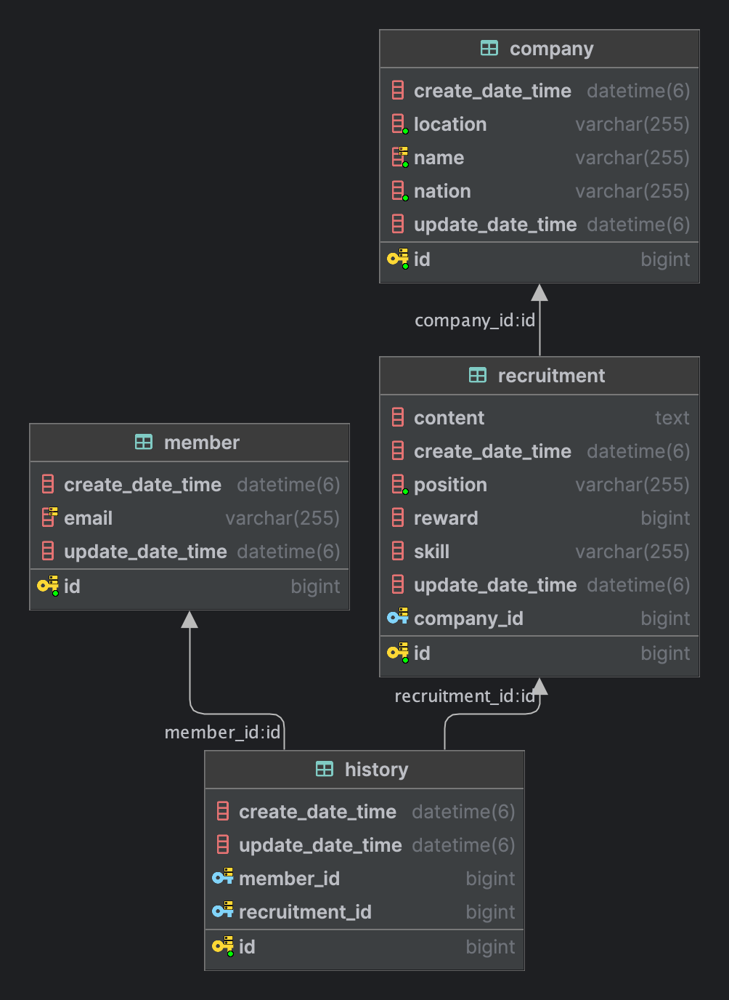

# 프리온보딩 백엔드 인턴십 선발과제

## Tech Stack

 
   
  
   
  

## 프로젝트 기능 및 설계

- 채용공고를 등록할 수 있습니다.
- 채용공고를 수정할 수 있습니다.
- 채용공고를 삭제할 수 있습니다.
- 채용공고 목록을 확인할 수 있습니다.
- 채용공고를 검색할 수 있습니다.
- 채용공고 상세 내용을 확인할 수 있습니다.
- 채용공고에 지원할 수 있습니다. (1회만 지원 가능)

## ERD

## API 명세서

[바로보기](doc/API.md)
